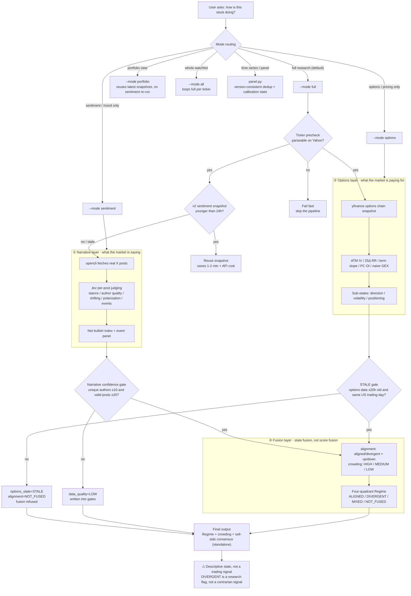

# stock-intelligence

[中文](README.md) | **English**

> X sentiment × options pricing → four-quadrant Regime. A US market state-research skill for coding agents.

**Outputs are always descriptive market states — not trading signals, not investment advice.**

## What it is

One skill, three modules, **late fusion of states** (never squashes all indicators into a single score):

| Layer | Answers | How |
|---|---|---|
| ① Narrative `sentiment/` | What is the market saying | Real X posts → per-post judging by Jev (stance / author quality / shilling detection / polarization / event extraction) → net bullish index + event panel |
| ② Options `options/` | What is the market paying for | yfinance chain snapshot → ATM IV / 25Δ RR / term slope / PC OI / naive GEX → direction / volatility / positioning sub-states |
| ③ Fusion `fusion.py` | Do the two markets agree | Four state fields (narrative_state / options_state / alignment / crowding) + data-quality gates → four-quadrant Regime |

Plus **sell-side consensus** (`analysts.py`, yfinance ratings / price targets / PE) shown as a standalone data point — it never enters the fusion.

## Decision flow



## Mode routing

| You ask | Mode | Command |
|---|---|---|
| "Show me NVDA sentiment" | sentiment | `uv run run.py --ticker NVDA --mode sentiment` |
| "What do NVDA options look like" | options | `uv run run.py --ticker NVDA --mode options` |
| "How is NVDA doing" (default) | full | `uv run run.py --ticker NVDA --mode full` |
| "Run the whole watchlist" | all | `uv run run.py --mode all` |
| "State of my portfolio" | portfolio | `uv run run.py --mode portfolio` |
| "Time series / panel" | panel | `uv run panel.py --ticker NVDA` |

## Install

### Prerequisites

- Python 3.12+ with [uv](https://docs.astral.sh/uv/); the only third-party dependency is `yfinance` (`pip install yfinance`, or `uv run --with yfinance ...`)
- **Narrative layer** (needed for sentiment / full): a `TYPESAFE_API_KEY` (Jev API); [opencli](https://github.com/anthropics/opencli) + Chrome extension, logged into x.com (`opencli doctor` to self-check; with multiple profiles, `opencli profile use <chrome>`)
- **Options layer / sell-side consensus**: just yfinance reachability (free, 15-min delayed, frozen values outside market hours)

### Steps

Option 1 — skills installer (**requires a public repo**; it only copies files into the skills directory — the runtime prerequisites above still apply):

```bash
npx skills add royal-byte/stock-intelligence
```

Option 2 — git clone (works for private repos too):

```bash
# Clone into your agent's skills directory
git clone https://github.com/royal-byte/stock-intelligence.git ~/.agents/skills/stock-intelligence
# For Claude Code specifically, clone into ~/.claude/skills/stock-intelligence

# Self-check
opencli doctor
```

Personalization (optional):

- `watchlist.json` — your watchlist and correlation clusters (portfolio mode uses `clusters` to flag "same cluster ≈ same trade")
- `sentiment/accounts.json` — KOL weighting (boost) / exclusion (zero), author names without @

## Usage

```bash
cd ~/.agents/skills/stock-intelligence
uv run run.py --ticker NVDA --mode full   # full research chain
uv run panel.py --ticker NVDA --csv out.csv
```

- Every run persists versioned snapshots under `data/` (`sentiment/`, `fusion/`, `portfolio/`; meta carries schema / prompt / fusion versions)
- Time series can only accumulate from your first run (X has no historical backfill); **running the watchlist daily with the same settings is the main way to build data**
- Best window is US market hours (21:30–04:00 Beijing time); outside market hours options are frozen values (≤20h degraded flag, >20h fusion refused)

## Interpretation discipline

- Net bullish index ∈ [-1,+1], midpoint 0, neutral within ±0.15; **not a probability of going up**; sampling confidence is reported separately
- Late fusion: narrative and options are presented independently; the Regime is four independent fields, never a single score
- **DIVERGENT is a research flag, not a contrarian trading signal** (work through the five explanations: sample bias / limited influence / institutions disagree / already priced in / narrative without money behind it)
- Event panels are unverified — always check primary sources (announcements / SEC / IR) before trading on them
- Extreme agreement (|net index| >0.35 or one-sided >80%) is a descriptive marker; the reversal relationship is untested
- Always-true boundaries: sentiment≠expected return · IV high≠bullish (IV is magnitude, not direction) · GEX is a hedging structure, not a direction forecast · sell-side ratings≠trading signals

Deep design docs: [references/sentiment-internals.md](references/sentiment-internals.md) (sentiment question definitions / weights / sampling), [references/backtest.md](references/backtest.md) (backtest routes and lag discipline)

## Disclaimer

This project outputs descriptive market-state research material. It is not investment advice. Markets carry risk; make your own decisions.

## License

[MIT](LICENSE)
