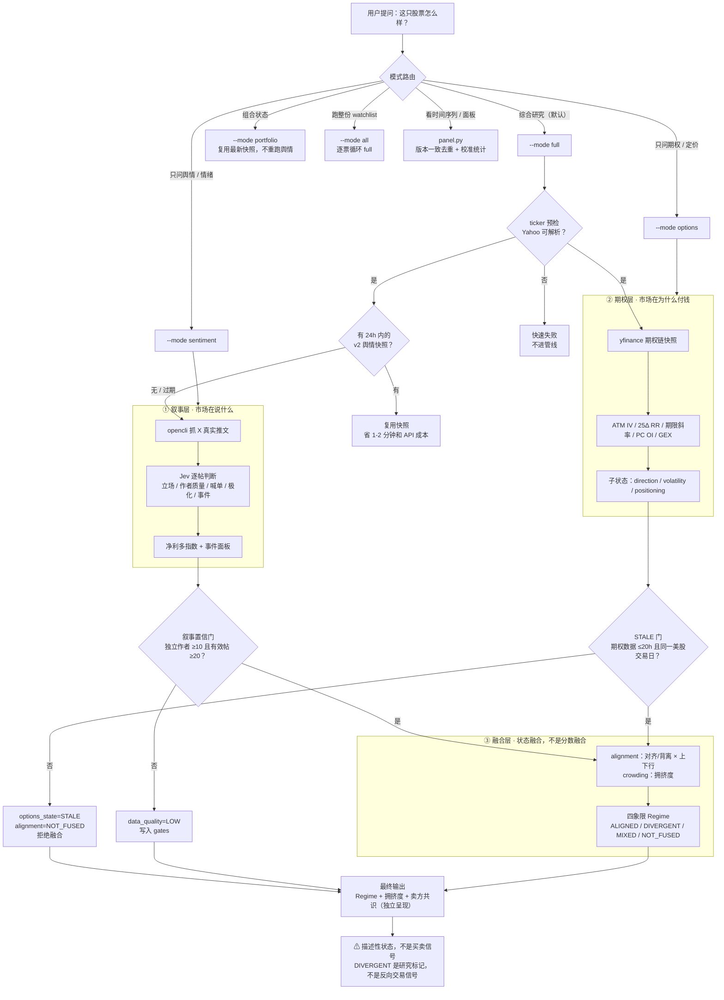

# stock-intelligence

**中文** | [English](README.en.md)

> X 舆情 × 期权定价 → 四象限 Regime。一个给 coding agent 用的美股市场状态研究 skill。

**输出永远是描述性市场状态，不是买卖信号，不构成投资建议。**

## 这是什么

一个 skill，三层模块，信息**晚融合、状态融合**（绝不把所有指标压成单一分数）：

| 层 | 回答的问题 | 做法 |
|---|---|---|
| ① 叙事层 `sentiment/` | 市场在说什么 | X 真实推文 → Jev 逐帖判断（立场 / 作者质量 / 喊单检测 / 极化 / 事件抽取）→ 净利多指数 + 事件面板 |
| ② 期权层 `options/` | 市场在为什么付钱 | yfinance 期权链快照 → ATM IV / 25Δ RR / 期限斜率 / PC OI / 朴素 GEX → direction / volatility / positioning 三车道子状态 |
| ③ 融合层 `fusion.py` | 两个市场一致吗 | 状态四字段（narrative_state / options_state / alignment / crowding）+ 数据质量门控 → 四象限 Regime |

另有**卖方共识**（`analysts.py`，yfinance 评级 / 目标价 / PE）作为独立数据点展示，不参与融合。

## 决策流程图



## 模式路由

| 你问 | 模式 | 命令 |
|---|---|---|
| "看下 NVDA 的舆情" | sentiment | `uv run run.py --ticker NVDA --mode sentiment` |
| "NVDA 期权什么样" | options | `uv run run.py --ticker NVDA --mode options` |
| "NVDA 现在怎么样"（默认） | full | `uv run run.py --ticker NVDA --mode full` |
| "跑一遍 watchlist" | all | `uv run run.py --mode all` |
| "我的组合什么状态" | portfolio | `uv run run.py --mode portfolio` |
| "看时间序列 / 面板" | panel | `uv run panel.py --ticker NVDA` |

## 安装

### 前置依赖

- Python 3.12+ 与 [uv](https://docs.astral.sh/uv/)；依赖仅 `yfinance`（`pip install yfinance` 或 `uv run --with yfinance ...`）
- **叙事层**（跑 sentiment / full 需要）：`TYPESAFE_API_KEY`（Jev 接口）；[opencli](https://github.com/anthropics/opencli) + Chrome 扩展，并已登录 x.com（`opencli doctor` 自检，多 profile 时 `opencli profile use <chrome>`）
- **期权层 / 卖方共识**：yfinance 可达即可（免费、15 分钟延迟、盘外时段为冻结值）

### 安装步骤

方式一：skills 安装器（**需仓库公开**；只负责把文件拷进 skills 目录，运行仍需上面的前置依赖）：

```bash
npx skills add royal-byte/stock-intelligence
```

方式二：git clone（私有仓库也适用）：

```bash
# 放进 agent 的 skills 目录（ZCode / Claude Code 等通用写法）
git clone https://github.com/royal-byte/stock-intelligence.git ~/.agents/skills/stock-intelligence
# Claude Code 单独用的话，clone 到 ~/.claude/skills/stock-intelligence

# 自检
opencli doctor
```

个性化配置（可选）：

- `watchlist.json` — 你的关注列表与相关性簇（portfolio 模式用 clusters 标注"同簇 ≈ 同一笔交易"）
- `sentiment/accounts.json` — KOL 加权（boost）/ 剔除（zero），作者名不带 @

## 使用

```bash
cd ~/.agents/skills/stock-intelligence
uv run run.py --ticker NVDA --mode full   # 完整研究链
uv run panel.py --ticker NVDA --csv out.csv
```

- 每次运行版本化落盘到 `data/`（`sentiment/`、`fusion/`、`portfolio/`，meta 带 schema / prompt / fusion 版本）
- 时间序列只能从首次运行开始积累（X 无历史回填）；**每日同口径跑 watchlist 是攒数据的主要方式**
- 最佳跑窗口为美股开盘时段（北京时间 21:30–04:00）；盘外跑期权为冻结值（≤20h 降级标注，>20h 拒绝融合）

## 解读纪律

- 净利多指数 ∈ [-1,+1]，中点是 0，±0.15 内中性；**不是上涨概率**；采样置信度与指数分开报
- 信息晚融合：叙事与期权独立呈现，Regime 是四个独立字段，不合成单一分数
- **DIVERGENT 是研究标记，不是反向交易信号**（五解释逐一排查：样本偏差 / 影响有限 / 机构不认同 / 已提前定价 / 叙事无资金跟随）
- 事件面板未经验证，交易决策前必须回源（公告 / SEC / IR）
- 极端一致（|净指数|>0.35 或单边>80%）是描述性标记，反转关系未回测
- 永远成立的边界：Sentiment≠预期收益 · IV 高≠看涨 · GEX 是对冲结构不是涨跌预测 · 卖方评级≠买卖信号

深入设计文档：[references/sentiment-internals.md](references/sentiment-internals.md)（舆情问题定义 / 权重公式 / 采样口径）、[references/backtest.md](references/backtest.md)（回测路线与 lag 纪律）

## 免责声明

本项目输出描述性市场状态研究材料，不构成任何投资建议。市场有风险，决策需独立。

## License

[MIT](LICENSE)
